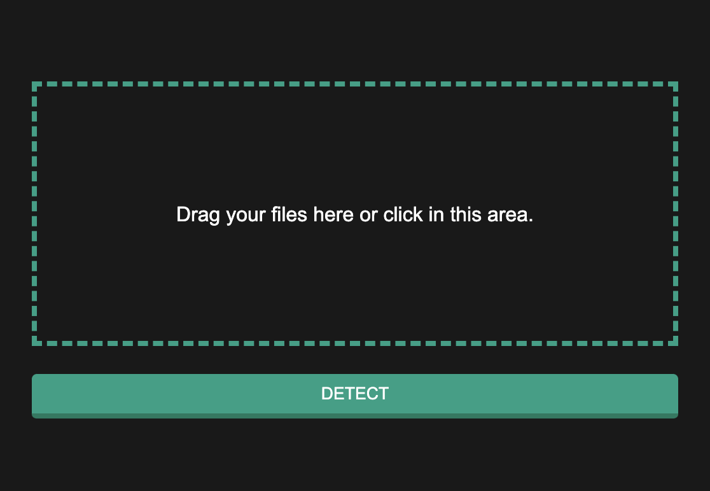
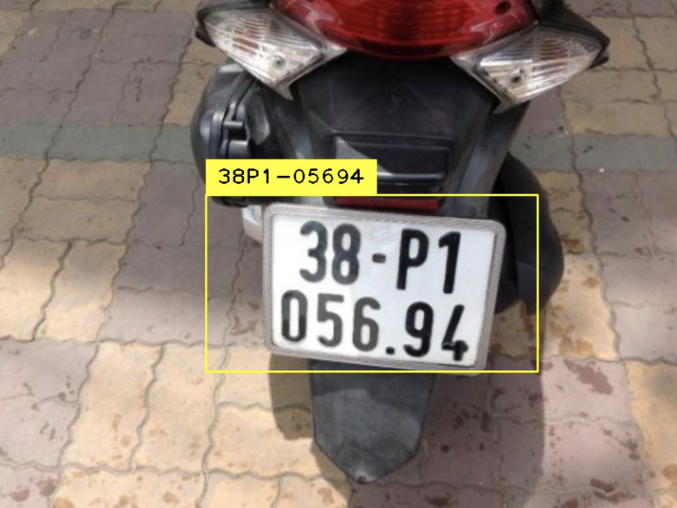

# License-plate-recognition-YOLO

## How to run

Install required packages:
> pip install -r requirements.txt

Run:
> python example.py -i [PathToImage]

Result's saved in file `result.jpg`

## Use online detector

Interface:

Select image file, hit `DETECT` and wait a bit:

